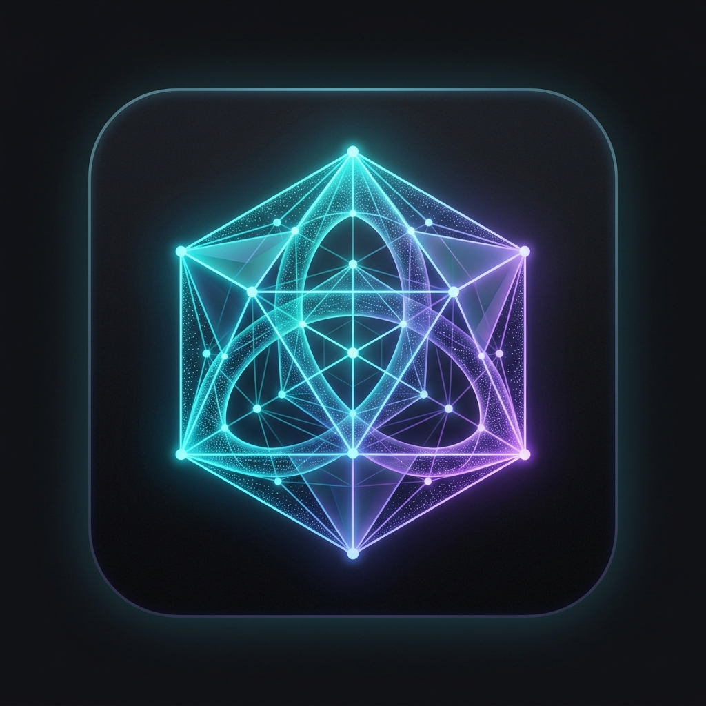
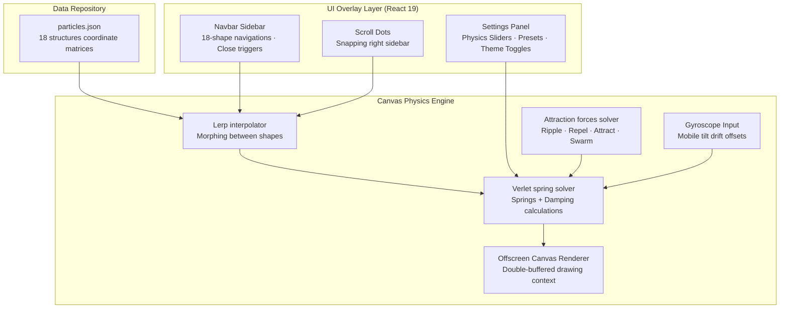
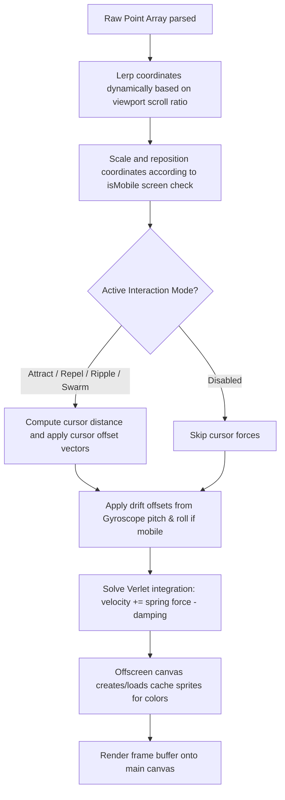

<p align="center">
  
</p>
<h1 align="center">3D Constructs</h1>
<p align="center">
  <strong>Interactive 3D Mathematical Geometry and Particle Physics Visualizer</strong><br/>
  <em>Navigate through a collapsible sidebar → explore 18 stunning mathematical shapes → morph, configure, and interact in real-time — all offline</em>
</p>

<p align="center">
  
  
  
  
  
  
  
</p>

---

## Table of Contents

- [Overview](#overview)
- [Why 3D Constructs](#why-3d-constructs)
- [Features](#features)
- [Architecture](#architecture)
- [Pipeline Flow and How It Works](#pipeline-flow-and-how-it-works)
- [Developer Integration Library](#developer-integration-library)
- [Application Walkthrough](#application-walkthrough)
- [Visual UI Guide](#visual-ui-guide)
  - [Left Collapsible Sidebar](#left-collapsible-sidebar)
  - [Interactive Settings Control Panel](#interactive-settings-control-panel)
  - [Right Scroll Indicators](#right-scroll-indicators)
- [Access and Launch Instructions](#access-and-launch-instructions)
  - [Running from Source](#running-from-source)
  - [Production Compilation](#production-compilation)
  - [Web Access](#web-access)
- [Project Structure and Key Components](#project-structure-and-key-components)
- [Dependencies](#dependencies)
- [Troubleshooting and Failsafes](#troubleshooting-and-failsafes)
- [Author](#author)

---

## Overview

**3D Constructs** is an interactive, local-first web application showcasing 18 complex mathematical geometries and biological shapes. It renders thousands of animated particles simulated in real-time on a high-performance interactive canvas. The app operates fully client-side, using React 19, TypeScript 6, and Vite 8, with offline support through a custom PWA Service Worker.

Users can seamlessly scroll to morph between shapes (such as the Synaptic Brain, DNA Double Helix, Torus Trefoil Knot, and Klein Bottle), adjust physics parameters (spring stiffness, damping, particle size/opacity, and rotation), toggle interaction modes (ripple, repel, attract, swarm, and disabled), and utilize mobile gyroscope sensor input forces.

---

## Why 3D Constructs

> **Most 3D web visualizations rely on heavy WebGL libraries like Three.js which require significant GPU overhead. 3D Constructs delivers fluid 3D simulations utilizing optimized HTML5 Canvas 2D math, ensuring compatibility and sub-millisecond physics updates on low-power devices.**

| Feature | Heavy WebGL Engines (Three.js/Babylon) | 3D Constructs |
|---|---|---|
| **Bundle Size** | Megabytes of JavaScript parsing overhead | Less than 20 KB of gzipped runtime code |
| **GPU Requirements** | Dedicated GPU or high-power mobile GPU required | Runs smoothly on low-end mobile devices and integrated CPUs |
| **Physics Control** | Hardcoded physics properties | Real-time spring solvers, damping, and multi-mode custom attraction forces |
| **Animation Morphing** | Linear mesh morphing with mesh-splitting artifacts | High-fidelity linear particle interpolation (lerp) across coordinate maps |
| **Offline Capability** | Complex asset loading, offline failures | PWA Service Worker caching for seamless offline runs |
| **Device Integration** | Standard mouse/touch controls | Integrated mobile gyroscope controls for physics-based particle drifting |

---

## Features

### 📐 18 Mathematical Shapes
*   **Geometric Structures**: Structured Octahedron, Geometric Cube, Torus Trefoil Knot, Geodesic Icosahedron, Hyperboloid, and Holistic Sphere.
*   **Organic & Biological Shapes**: Synaptic Brain, Innovating Lightbulb, and DNA Double Helix.
*   **Abstract Mathematical Constructs**: Nebula Spindle Star, Intersecting Aegis, Flowing Torus, Nova Spire Lattice, Astroid Star, Email Envelope, Quantum Dual Shell, Klein Bottle, and Cosmic Scattered.
*   **Theme Adjustments**: Redesigned light/dark templates with white particles turning into premium red (`#ef4444`) in light mode and page headers converting to dark-slate to red gradients.

### 🧪 Advanced Particle Physics
*   **Verlet Integration**: Every particle follows spring mechanics pulling it back to its active coordinate slot, with customizable stiffness and damping.
*   **Real-time Morphing**: Vertical viewport scrolls trigger mathematical interpolation (`lerp`) between shapes, creating fluid transitions.
*   **Custom Particle Configs**: User controls for particle count, particle size, and opacity to tailor performance.

### 🖱️ Dynamic Interaction Modes
*   **Ripple**: Emits waves pushing particles away outwards on cursor move.
*   **Repel**: Pushes particles away from the cursor radius.
*   **Attract**: Pulls particles toward the cursor coordinates.
*   **Swarm**: Particles form a swarm following the cursor movement.
*   **Disabled**: Static physics without cursor interactions.
*   **Mobile Gyroscope**: Interactive mobile tilting causes particles to drift in 3D space, responding to device pitch and roll.

### 🎨 Premium Glassmorphic Design System
*   **Collapsible Sidebar**: Compact left navigation bar, auto-collapsing to a hamburger menu, with custom close triggers (`X`), scrollable listing, and active section highlights.
*   **Glassmorphism**: Backdrop filters (`blur(25px)`) and semi-transparent panels creating premium glass interfaces.
*   **Index Indicators**: Snapping dot scrollbars on the right viewport edge for fast index navigation.
*   **Atomic State Synchronization**: Seamless settings modifications without canvas restarts.

---

## Architecture



<details>
<summary>ASCII fallback (click to expand)</summary>

```
┌────────────────────────────────────────────────────────────────────────┐
│                        3D Constructs Application                       │
│                                                                        │
│  ┌────────────────────────┐            ┌─────────────────────────────┐ │
│  │   UI Overlay Layer     │            │        Data Repository      │ │
│  │ (React 19 & TypeScript)│            │                             │ │
│  │  ┌─────────┐ ┌────────┐│            │   ┌─────────────────────┐   │ │
│  │  │ Sidebar │ │Settings││            │   │   particles.json    │   │ │
│  │  │ Navbar  │ │ Panel  ││            │   │ (18 shape matrices) │   │ │
│  │  └────┬────┘ └───┬────┘│            │   └──────────┬──────────┘   │ │
│  └───────┼──────────┼─────┘            └──────────────┼──────────────┘ │
│          │          │                                 │                │
│          ▼          ▼                                 ▼                │
│  ┌───────┴──────────┴─────────────────────────────────┴─────────────┐  │
│  │                         Canvas Physics Engine                    │  │
│  │                                                                  │  │
│  │    ┌─────────────────────┐            ┌──────────────────────┐   │  │
│  │    │  Shape Morphing     │            │ Verlet Physics Loop  │   │  │
│  │    │  (Linear Lerp)      ├───────────►│ (Springs + Damping)  │   │  │
│  │    └─────────────────────┘            └──────────┬───────────┘   │  │
│  │                                                  ▲               │  │
│  │    ┌─────────────────────┐  ┌────────────────┐   │               │  │
│  │    │ Cursor Forces       │  │ Gyroscope Tilt │───┘               │  │
│  │    │ (Ripple/Repel/Swarm)│  │ (Mobile Drift) │                   │  │
│  │    └─────────────────────┘  └────────────────┘                   │  │
│  │                                                  │               │  │
│  │                                                  ▼               │  │
│  │                                       ┌──────────────────────┐   │  │
│  │                                       │   Canvas 2D Render   │   │  │
│  │                                       │ (requestAnimFrame)   │   │  │
│  │                                       └──────────────────────┘   │  │
│  └──────────────────────────────────────────────────────────────────┘  │
└────────────────────────────────────────────────────────────────────────┘
```

</details>

---

## Pipeline Flow and How It Works

### High-Level Path Diagram



<details>
<summary>ASCII fallback (click to expand)</summary>

```
Point Array parsed from JSON database (particles.json)
     │
     ▼
Lerp coordinates dynamically based on viewport scroll ratio (Morphing)
     │
     ▼
Scale and reposition coordinates according to isMobile screen check
     │
     ▼
Check active interaction mode:
   ├─► Attract/Repel/Ripple/Swarm → Calculate cursor distance and apply force offset vector
   └─► Disabled → Skip cursor forces
     │
     ▼
Apply drift offsets from gyroscope pitch and roll (if on mobile)
     │
     ▼
Solve Verlet integration: velocity += (target - current) * stiffness - velocity * damping
     │
     ▼
Offscreen Canvas caches particle sprites (optimized color rendering)
     │
     ▼
Render frame buffer onto main HTML5 Canvas context
```

</details>

### General Processing Overview

1.  **Coordinates Parsing**: On startup, `ParticleCanvas.tsx` reads 18 pre-compiled 3D coordinates arrays from `particles.json`.
2.  **Morphing Interpolation**: The active scroll position tracks the viewport, determining the interpolation weight (`t`) between the current shape and the next shape. The engine uses linear interpolation (`lerp`) to calculate each particle's target destination.
3.  **Screen Scale Adjustments**: The canvas automatically checks screen dimensions. Desktop shapes use left/right off-centers to accommodate sidebar layouts, while mobile shapes are shifted down by 10% (`H * 0.45`) to sit cleanly below mobile headings.
4.  **Physics Integration**: For every frame, the spring solver updates each particle's velocity toward its target coordinates based on the configured spring stiffness and damping coefficients.
5.  **Force Fields**: Cursor coordinates alter particle velocities dynamically. Ripples emit outward waves, repellers push particles away, attractors drag particles toward the mouse, and swarms pull particles behind the cursor.
6.  **Sprite Caching**: To maximize performance, particles are pre-drawn onto a hidden offscreen canvas for each color, caching them as sprites. The main canvas draws these cached sprites, bypassing expensive pixel-rendering operations.

## Developer Integration Library

3D Constructs is designed not only as an interactive visual showcase, but also as a reusable library. Developers can extract the raw coordinates database, mount the high-performance physics canvas component in their own React/Vite/TypeScript projects, or copy the generative mathematical algorithms to dynamically construct complex polyhedrons.

### 1. Extracting and Reusing Raw Coordinate Maps (`particles.json`)

The raw coordinates for all 18 structures are stored in the compiled database [`particles.json`](file:///c:/Users/Felix/Desktop/experiment%20-%20Copy/src/data/particles.json). 

#### Database Format
The root of the JSON file is a dictionary mapping shape names (camelCase) to arrays of exactly 7,000 coordinate objects:
```json
{
  "brain": [
    { "x": 0.0512, "y": -0.1245, "z": 0.3214, "colorIndex": 0, "scaleFactor": 1.0 },
    ...
  ],
  "lightbulb": [ ... ]
}
```

Each particle node contains:
*   `x`, `y`, `z`: Floating-point coordinates normalized in 3D space (ranging roughly from `-1.0` to `1.0`).
*   `colorIndex`: An integer `0`, `1`, `2`, or `3` mapping the particle to one of the four sequential color bands.
*   `scaleFactor`: A scalar indicating depth-relative size mapping.

#### Three.js Integration Example
To load these structures into a Three.js buffer geometry:
```javascript
import rawParticles from './path/to/particles.json';

function createParticleSystem(shapeKey) {
  const points = rawParticles[shapeKey]; // e.g., 'brain'
  const geometry = new THREE.BufferGeometry();
  const positions = new Float32Array(points.length * 3);
  const colors = new Float32Array(points.length * 3);
  
  const palette = [
    new THREE.Color('#ffb829'), // Color 0
    new THREE.Color('#00ff00'), // Color 1
    new THREE.Color('#0ffff0'), // Color 2
    new THREE.Color('#ffffff')  // Color 3
  ];

  points.forEach((pt, i) => {
    positions[i * 3]     = pt.x * 5.0; // Scale multiplier
    positions[i * 3 + 1] = pt.y * 5.0;
    positions[i * 3 + 2] = pt.z * 5.0;
    
    const color = palette[pt.colorIndex];
    colors[i * 3]     = color.r;
    colors[i * 3 + 1] = color.g;
    colors[i * 3 + 2] = color.b;
  });

  geometry.setAttribute('position', new THREE.BufferAttribute(positions, 3));
  geometry.setAttribute('color', new THREE.BufferAttribute(colors, 3));
  
  const material = new THREE.PointsMaterial({
    size: 0.1,
    vertexColors: true,
    transparent: true,
    opacity: 0.8
  });
  
  return new THREE.Points(geometry, material);
}
```

---

### 2. Integrating the `ParticleCanvas` React Component

To drop the interactive particle physics engine directly into your own React / Vite / TypeScript applications:

#### Step A: Copy Component Code
Copy the following files from this repository into your project's component folders:
1.  [`src/components/ParticleCanvas.tsx`](file:///c:/Users/Felix/Desktop/experiment%20-%20Copy/src/components/ParticleCanvas.tsx) (Physics engine, canvas drawer, event listeners).
2.  [`src/types.ts`](file:///c:/Users/Felix/Desktop/experiment%20-%20Copy/src/types.ts) (Configuration type structures and default presets).
3.  [`src/data/particles.json`](file:///c:/Users/Felix/Desktop/experiment%20-%20Copy/src/data/particles.json) (Pre-compiled coordinate lists).

#### Step B: Install Core Peer Dependencies
Make sure you have React 18+ and TypeScript set up:
```bash
npm install react react-dom
npm install -D @types/react @types/react-dom typescript
```

#### Step C: Add Canvas Global Styles
Add these rules to your stylesheet (e.g., `index.css`) to ensure the canvas is positioned behind your content and handles transitions properly:
```css
.canvas-container {
  position: fixed;
  top: 0;
  left: 0;
  width: 100vw;
  height: 100vh;
  z-index: 0;
  pointer-events: none;
}

#particle-canvas {
  display: block;
  width: 100%;
  height: 100%;
}
```

#### Step D: Mount the Component
You can now import and mount `ParticleCanvas` anywhere in your React component tree, passing in state configuration settings:
```tsx
import React, { useState } from "react";
import ParticleCanvas from "./components/ParticleCanvas";
import { AppSettings, DEFAULT_SETTINGS } from "./types";

export default function App() {
  const [settings, setSettings] = useState<AppSettings>(DEFAULT_SETTINGS);

  return (
    <div style={{ position: "relative", minHeight: "100vh", color: "#fff" }}>
      {/* Background visualizer */}
      <div className="canvas-container">
        <ParticleCanvas settings={settings} />
      </div>

      {/* Foreground Interactive Layout */}
      <main style={{ position: "relative", zIndex: 1, padding: "2rem" }}>
        <h1>Interactive Space</h1>
        <button onClick={() => setSettings(s => ({ ...s, theme: s.theme === "black" ? "white" : "black" }))}>
          Toggle Theme
        </button>
      </main>
    </div>
  );
}
```

---

### 3. Reusing the Generative Polyhedron Mathematics

If you want to generate customized 3D particle shapes programmatically rather than using pre-compiled JSON files, you can reuse the mathematical algorithms defined in [`ParticleCanvas.tsx`](file:///c:/Users/Felix/Desktop/experiment%20-%20Copy/src/components/ParticleCanvas.tsx):

#### Uniform Triangle Sampling (`sampleTriangle`)
Samples coordinates randomly on a 3D triangle plane using barycentric weights. Essential for generating clean polygon faces:
```typescript
function sampleTriangle(
  a: { x: number; y: number; z: number },
  b: { x: number; y: number; z: number },
  c: { x: number; y: number; z: number }
): { x: number; y: number; z: number } {
  let r1 = Math.random();
  let r2 = Math.random();
  if (r1 + r2 > 1) {
    r1 = 1 - r1;
    r2 = 1 - r2;
  }
  const r3 = 1 - r1 - r2;
  return {
    x: r1 * a.x + r2 * b.x + r3 * c.x,
    y: r1 * a.y + r2 * b.y + r3 * c.y,
    z: r1 * a.z + r2 * b.z + r3 * c.z,
  };
}
```

#### Circular Coordinate Sorting (`sortCircular`)
Sorts coplanar 3D polygon vertex sets in exact circular cycle order (to avoid wireframe cross-over/intersecting artifacts):
```typescript
function sortCircular(neighbors: number[], icoEdges: number[][]): number[] {
  const sorted: number[] = [neighbors[0]];
  let current = neighbors[0];
  while (sorted.length < 5) {
    const next = neighbors.find(n =>
      !sorted.includes(n) &&
      icoEdges.some(e => (e[0] === current && e[1] === n) || (e[0] === n && e[1] === current))
    );
    if (next !== undefined) {
      sorted.push(next);
      current = next;
    } else {
      break;
    }
  }
  return sorted;
}
```

#### Uniform Edge / Face Splitter (`generatePolyhedron`)
This algorithm takes a list of 3D vertices, edge indexes, and face indexes, and generates a structured array of 7,000 points split between edges and faces, grouped into 4 distinct color bands:
```typescript
function generatePolyhedron(
  vertices: { x: number; y: number; z: number }[],
  edges: number[][],
  faces: number[][],
  edgeRatio: number // e.g., 0.75 for 75% edges
): { x: number; y: number; z: number; colorIndex: number }[] {
  const points: { x: number; y: number; z: number; colorIndex: number }[] = [];
  const targetTotal = 7000;
  const edgePointsTarget = Math.round(targetTotal * edgeRatio);
  const facePointsTarget = targetTotal - edgePointsTarget;

  // 1. Generate Edge Points (distributed uniformly across all edges)
  const pointsPerEdge = Math.floor(edgePointsTarget / edges.length);
  edges.forEach((edge) => {
    const v1 = vertices[edge[0]];
    const v2 = vertices[edge[1]];
    for (let i = 0; i < pointsPerEdge; i++) {
      const t = Math.random();
      points.push({
        x: lerp(v1.x, v2.x, t),
        y: lerp(v1.y, v2.y, t),
        z: lerp(v1.z, v2.z, t),
        colorIndex: 0 // Will assign groups sequentially later
      });
    }
  });

  // 2. Generate Face Points (distributed uniformly across all faces)
  if (faces.length > 0) {
    const pointsPerFace = Math.floor(facePointsTarget / faces.length);
    faces.forEach((face) => {
      // Triangulate face if it has more than 3 vertices
      // and sample points uniformly using sampleTriangle
      ...
    });
  }

  // 3. Sequential Color Band Partitioning
  // Sort points by Y-coordinate and partition into 4 groups of equal length
  points.sort((a, b) => a.y - b.y);
  const size = Math.floor(points.length / 4);
  points.forEach((pt, idx) => {
    pt.colorIndex = Math.min(Math.floor(idx / size), 3);
  });

  return points;
}
```

---

## Application Walkthrough

### Starting the Application
When the user accesses the visualizer:
1.  **Service Worker Activation**: `sw.js` initializes in the background, pre-caching critical shell files (`index.html`, `logo.png`, styles) to enable offline execution.
2.  **App Setup**: `App.tsx` loads, initializing settings with defaults or presets.
3.  **Canvas Setup**: `ParticleCanvas` initializes its physics loop, mapping system memory allocations for 7,000 baseline particles.
4.  **Layout Rendering**: Visual components load alongside the canvas, placing the collapsible sidebar on the left and the scroll indicators on the right.

### Customizing & Interacting
-  **Adjust Settings**: Click the settings gear icon bottom-left to slide open the glassmorphic control drawer. Modify values or select preset layouts (neural, chaotic, magnetic, swarm).
-  **Navigation**: Click items in the sidebar or right scroll dots to trigger smooth scroll morphing. Clicking `3d Constructs` or `X` collapses the sidebar back to menu mode.
-  **Light Mode**: Toggle the white theme option in Settings. The background shifts to white, the sidebar turns to a light-grey glass pane, headings colorize with dark-blue/red gradients, and white particles render as vibrant red.

---

## Visual UI Guide

The interface is structured to prioritize high-fidelity visuals, responsiveness, and premium design:

```
┌────────────────────────────────────────────────────────┐
│[3d Constructs ╳]                                       │
│                                                        │
│  3D LIBRARY                                            │
│  • Synaptic Brain                                    • │
│  • Geometric Cube                                    • │
│  • Torus Trefoil                                     • │
│  • Klein Bottle                                      • │
│                                                      • │
│                                                      • │
│                                                      • │
│                                                      • │
│                                                      • │
│                                                        │
│[⚙️ Settings]                                          │
└────────────────────────────────────────────────────────┘
```

### Left Collapsible Sidebar

| UI Element | Description | Interaction |
|---|---|---|
| **Branded Title** | Heading showing "3d Constructs" with custom gradient. | Clicking collapses the sidebar. |
| **Close Button (`╳`)** | Subtle close icon next to the title. | Clicking collapses the sidebar. |
| **3D Library List** | 18-item list of all mathematical constructs. | Clicking scroll-morphs to the chosen index. |
| **Middle Scroll Container** | Flex-grow section with high-contrast teal scrollbar. | Enables internal scrolling on small screens. |
| **Settings Link** | Action button displaying Settings icon. | Toggles settings panel drawer. |
| **GitHub link** | Integrates link to the code repository. | Opens `https://github.com/Felix-au/...` |
| **Profile link** | Direct link button to the author profile. | Opens `https://www.felixau.in/` |

---

### Interactive Settings Control Panel

| Control | Type | Values / Defaults | Purpose |
|---|---|---|---|
| **Presets** | Button Group | Neural, Chaotic, Magnetic, Swarm | Instantly load specialized physics configurations. |
| **Theme** | Toggle | Black (Dark), White (Light) | Change visual color themes. |
| **Particle Count** | Slider | 1,000 - 15,000 (Default: 7,000) | Adjust particle count (performance optimization). |
| **Particle Size** | Slider | 1.0 - 6.0 px (Default: 3.0) | Adjust particle thickness. |
| **Particle Opacity** | Slider | 0.1 - 1.0 (Default: 0.75) | Adjust transparency of the color bands. |
| **Interaction Mode** | Select | Ripple, Repel, Attract, Swarm, Disabled | Choose mouse interaction mechanics. |
| **Interaction Force** | Slider | 0.5 - 5.0 (Default: 2.0) | Modify mouse force strength. |
| **Interaction Radius** | Slider | 50 - 250 px (Default: 100) | Set cursor field radius. |
| **Spring Stiffness** | Slider | 0.005 - 0.1 (Default: 0.01) | Change coordinate spring attraction strength. |
| **Damping** | Slider | 0.80 - 0.99 (Default: 0.90) | Modify friction dampening on particle movement. |
| **Gyroscope Enable** | Toggle | Enabled / Disabled | Enable mobile tilting control. |
| **Auto Rotate Speed** | Slider | 0.0 - 5.0 (Default: 1.0) | Set particle system rotation velocity. |

---

### Right Scroll Indicators

| UI Element | Description | Interaction |
|---|---|---|
| **Indicator Bar** | Vertical dotted scrollbar positioned on the right screen edge. | Tracks section scrolling. |
| **Scroll Dots** | 18 individual dots representing each mathematical construct. | Clicking snaps view to that index. |
| **Active Dot** | Glow-accented dot representing the active viewport section. | Visual reference of current scrolling index. |

---

## Access and Launch Instructions

### Running from Source

**Prerequisites:** Node.js 18+, npm (or yarn / pnpm).

1.  **Clone the Repository**:
    ```bash
    git clone https://github.com/Felix-au/3d-Constructs-Library.git
    cd 3d-Constructs-Library
    ```
2.  **Install Dependencies**:
    ```bash
    npm install
    ```
3.  **Run Development Server**:
    ```bash
    npm run dev
    ```
    Open `http://localhost:5173/` in your browser.

---

### Production Compilation

To compile and verify code correctness for production deployments:
1.  **Type Check & Lint**:
    ```bash
    npx tsc --noEmit
    npm run lint
    ```
2.  **Build Production Assets**:
    ```bash
    npm run build
    ```
    This outputs optimized, minified production assets into the `dist/` directory.

---

### Web Access

Access the live production build instantly at:
*   **Canonical URL**: [https://3dconstructs.felixau.in/](https://3dconstructs.felixau.in/)

---

## Project Structure and Key Components

```
├── DocumentaionInstruct/ # Standard reference files
├── public/               # Asset assets and PWA manifests
│   ├── sw.js             # Offline Service Worker
│   ├── logo.png          # App icon
│   └── manifest.webmanifest
├── src/
│   ├── components/
│   │   ├── Navbar.tsx          # Collapsible left sidebar
│   │   ├── ParticleCanvas.tsx  # Canvas particle physics engine
│   │   └── SettingsPanel.tsx   # Glassmorphic control drawer
│   ├── data/
│   │   └── particles.json      # Shapes coordinate arrays
│   ├── App.tsx           # App root and section layout
│   ├── index.css         # Style system and themes
│   ├── main.tsx          # App entry point & SW registry
│   └── types.ts          # Settings and presets type definitions
```

### Key Components

| Component / File | Functional Purpose |
|---|---|
| [`App.tsx`](src/App.tsx) | Renders overlays, mounts canvas, tracks vertical viewport scrolling, and synchronizes the active section. |
| [`ParticleCanvas.tsx`](src/components/ParticleCanvas.tsx) | Mathematical engine running the `requestAnimationFrame` render loop, linear morphing, Verlet integrations, and gyroscope/mouse event binding. |
| [`Navbar.tsx`](src/components/Navbar.tsx) | Renders the vertical sidebar menu, close triggers, shape listing, and settings/profile integration buttons. |
| [`SettingsPanel.tsx`](src/components/SettingsPanel.tsx) | Handles presets, theme switching, and particle controls. |
| [`particles.json`](src/data/particles.json) | The compiled database containing coordinate mappings for all 18 structures. |
| [`sw.js`](public/sw.js) | Caches files to enable running the visualizer offline. |

---

## Dependencies

Crucial project dependencies are kept minimal to ensure performance:

| Dependency | Category | Version | Purpose |
|---|---|---|---|
| **React** | Core Library | `^19.2.7` | UI component architecture and state management. |
| **React DOM** | Core Library | `^19.2.7` | DOM rendering. |
| **Vite** | Dev Dependency | `^8.1.0` | High-performance bundler. |
| **TypeScript** | Dev Dependency | `~6.0.2` | Strong type safety. |
| **Oxlint** | Dev Dependency | `^1.69.0` | Ultra-fast JS/TS linter. |

---

## Troubleshooting and Failsafes

### Troubleshooting Guide

| Issue | Root Cause | Resolution |
|---|---|---|
| **Low Framerates (Lag)** | Too many particles active on lower-end CPUs. | Open Settings → Reduce **Particle Count** slider (e.g. to 3,000). |
| **Mobile Gyroscope Fails** | Insecure HTTP connection or missing sensor permission. | Ensure you are on HTTPS (`https://...`). Tilt permissions must be approved. |
| **Missing Scrollbar / Cutoff** | `box-sizing` layout conflicts on sidebar containers. | Handled via local `box-sizing: border-box` resets on the `.site-navbar` tree. |
| **Scroll Snapping Issues** | Scroll snapping is disabled or active. | Snapping can be enabled or disabled in the Settings drawer dynamically. |
| **Light Theme Contrast** | Light theme styles missing or incorrect background variables. | Fixed with styling overrides in `index.css` applying `.theme-white` modifiers. |

### Core Failsafes
*   **Max Particle Cap**: Particle count is restricted to 15,000 to prevent system memory overflows.
*   **Friction Damping Boundaries**: Minimum damping is restricted to `0.80` to prevent infinite particle drift.
*   **Failsafe Physics Spring Limits**: Maximum spring stiffness is capped at `0.1` to prevent visual tearing during shape morphs.

---

## Author

<p align="center">
  <strong>Felix Au</strong><br/>
  <a href="https://github.com/Felix-au">GitHub Profile</a> • <a href="mailto:felix@felixau.in">Email Contact</a> • <a href="https://www.felixau.in/">Portfolio Website</a>
</p>

<p align="center"><sub>Bringing mathematical geometry to life through fluid, interactive particle physics.</sub></p>
